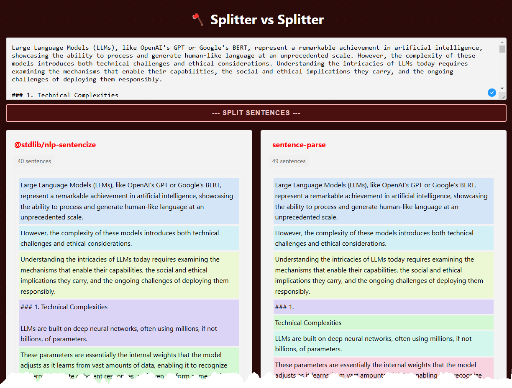

# 🪓 Splitter vs Splitter

A web-based tool to compare different sentence splitting libraries side by side. Currently compares:
- [@stdlib/nlp-sentencize](https://www.npmjs.com/package/@stdlib/nlp-sentencize)
- [string-segmenter](https://www.npmjs.com/package/string-segmenter)

## Features
- Real-time sentence splitting comparison
- Visual color-coding of sentences for easy comparison
- Sentence count display
- Responsive design
- Keyboard shortcuts (Ctrl + Enter to split)

## Tech Stack
- Vanilla JavaScript
- Vite for building and development
- CSS3 with Flexbox
- No external UI libraries or frameworks

## Getting Started

### Prerequisites
- Node.js (v14 or higher)
- npm (v6 or higher)

### Installation
1. Clone the repository:
```bash
git clone https://github.com/yourusername/splitter-vs-splitter.git
cd splitter-vs-splitter
```

2. Install dependencies:
```bash
npm install
```

### Development
Run the development server:
```bash
npm run dev
```

### Production Build
Build for production:
```bash
npm run build
```

Preview the production build:
```bash
npm run preview
```

## Usage
1. Enter or paste your text in the input area
2. Click "Split Sentences" or press Ctrl + Enter
3. Compare the results from both libraries side by side
4. Each sentence is highlighted with a matching color in both outputs for easy comparison

## Example
